# kidsblock Start-up
## 1. Introduction

Based on Scratch3.0, Kidsblock graphical programming is an editor with secondary development aiming to enable students to understand the fundamental concepts of programming. 

Through the comprehensive projects learning, kids will have an in-depth understanding of logical content, such as conditions, functions, linked lists, etc.. In the same breath, it can help children learn efficient problem-solving methods of thinking  (abstract, model, algorithm, decomposition) --- programming thinking.

Besides, to prevent children from focusing on the use of tools when learning, the software is combined with a graphical editor and code visualization. Languages and tools are diverse, yet programming is inter-operable. In the application of this software, the training of programming thinking is the core element. Hence, learning the way of thinking efficiently can not be limited to the tool itself, but it can pave the way for future life or for advanced programming languages.

| Hardware Support |	Programming Language Support	|Realtime Support|
|:-------------:|:---------------------:|:--------------:|
|Arduino Series		| graphical, Arduino C/C++ |		Yes		|
|Micro:bit V1/V2|	graphical, MicroPython	|		Yes		|
|ESP8266		| graphical, Arduino C/C++ |		No		|
|ESP32			| graphical, Arduino C/C++ |		Yes		|

Based on learning and application, it simplifies code through graphical building blocks to make learning and understanding much easier. What's more, source code is displayed on the right during the whole process, so you can also learn the underlying code.

In addition to graphics, it also supports Arduino and MicroPython. Common hardware support: Arduino series, Micro:bit, ESP8266, ESP32.

## 2. Download Software

* For Windows System: [xiazai.keyesrobot.cn/KidsBlock.exe](https://xiazai.keyesrobot.cn/KidsBlock.exe)
* For MAC System: [xiazai.keyesrobot.cn/KidsBlock.dmg](https://xiazai.keyesrobot.cn/KidsBlock.dmg)

Video Guidance of Installation for MAC System
Video: 

Video Guidance of Installation for Windows System
Video:

## 3. Install Driver
Click  at the upper-right conner to select . The commonly-used serial driver are packaged in software. 

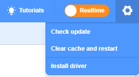

## 4. Function Description
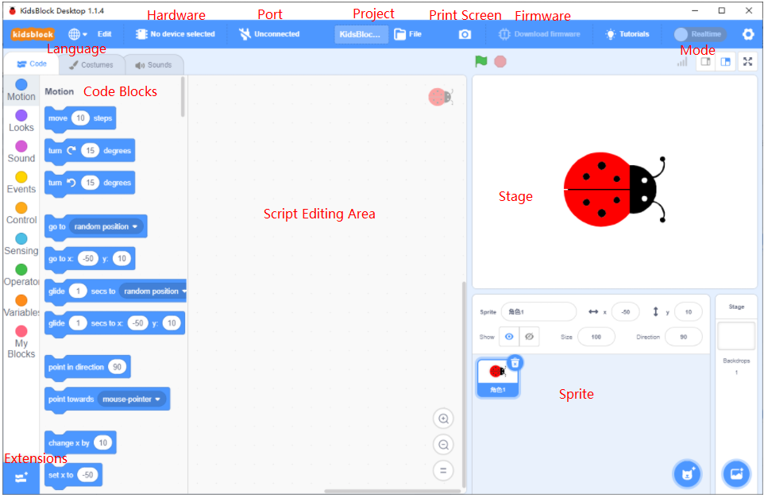

## 5. Commonly-used Functions
5-1 Select a Hardware
By default, the main interface is Scratch animation programming. At this time, if there is no device connected, you do not need to shift the interface, which is the same as that of Scratch3.0.

When you want to link a hardware to your computer, you need to click select one: 

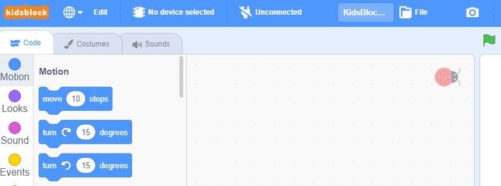

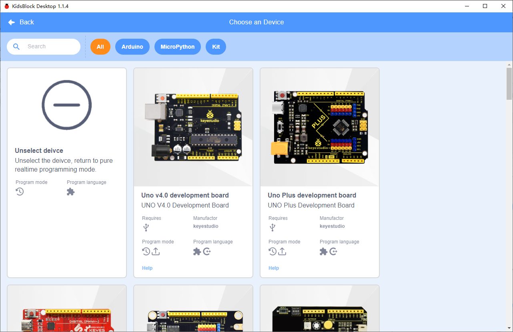

And select a corresponding serial port: 

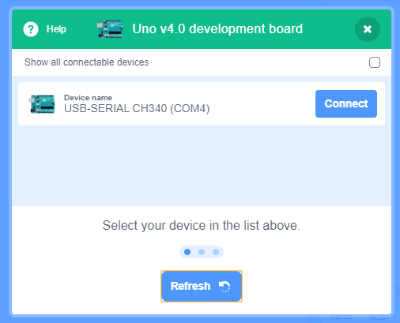

After selecting hardware, it will automatically jump to the selection of programming language and serial port (COM). Choose the one corresponding to the hardware. 

Pay attention that do not open software with multiple serial ports, otherwise you may not find port because it is occupied by other applications, and the driver will also be activated unsuccessfully.

## 5-2 Realtime Mode
In realtime mode, it integrates animation and hardware programming. When any condition is met, the animation or hardware makes the conditional action. Before that, please remember to download firmware. 

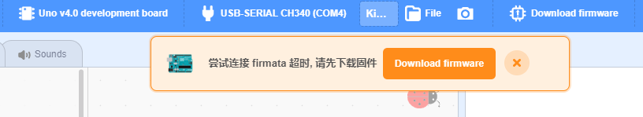

## 5-3 Upload Mode
In upload mode, programs can be saved in hardware to be executed. 

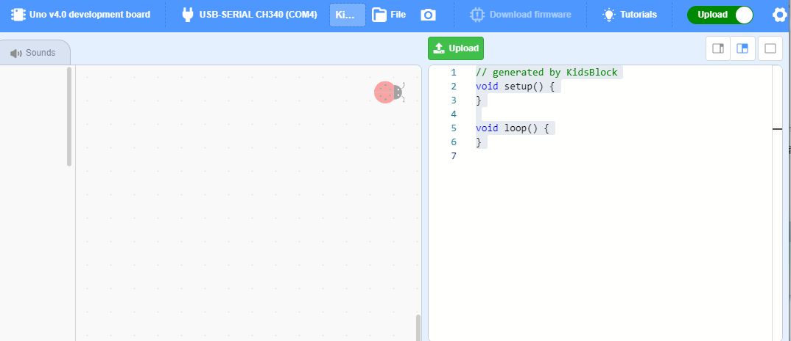

Firstly we select hardware and connections (same as Realtime mode). In this mode, the matters are only about mainboard or modules, and it has nothing to do with animations. 

Generally, there are some basic functional blocks on the left bar, or you may click to extend more functions. 

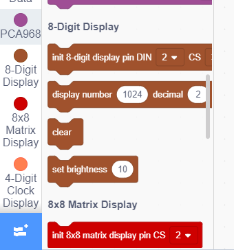

Now you can choose an extension:

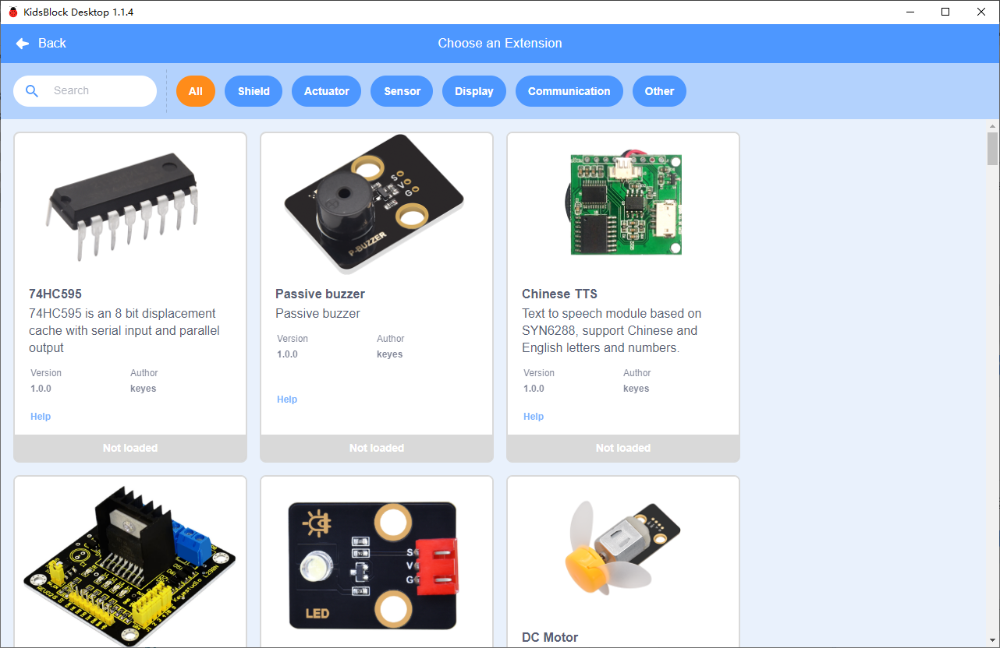

When you finish a code, click **Upload**. 

At this time, please ensure that the hardware connection and logic/definition of the program are correct, otherwise it will fail to be uploaded and an error will occur during compilation.

**NOTE**: The compilation and uploading speed are impacted by the complexity of programs as well as the configuration of your computer. If the communication fails to reach hardware for a long time, it will automatically stop. Under this condition, please check the stability of the hardware.

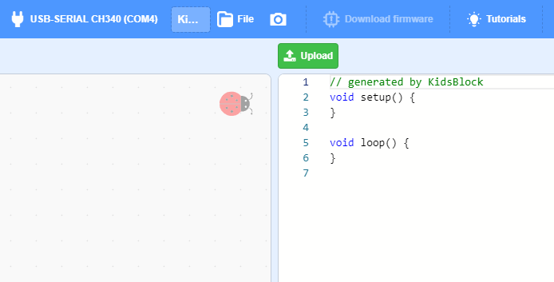

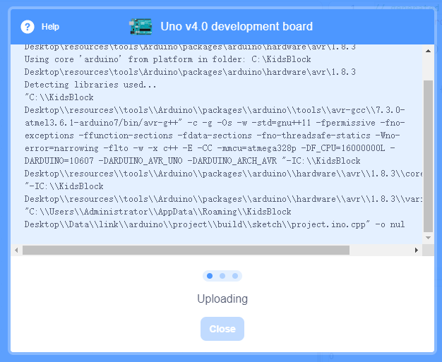
